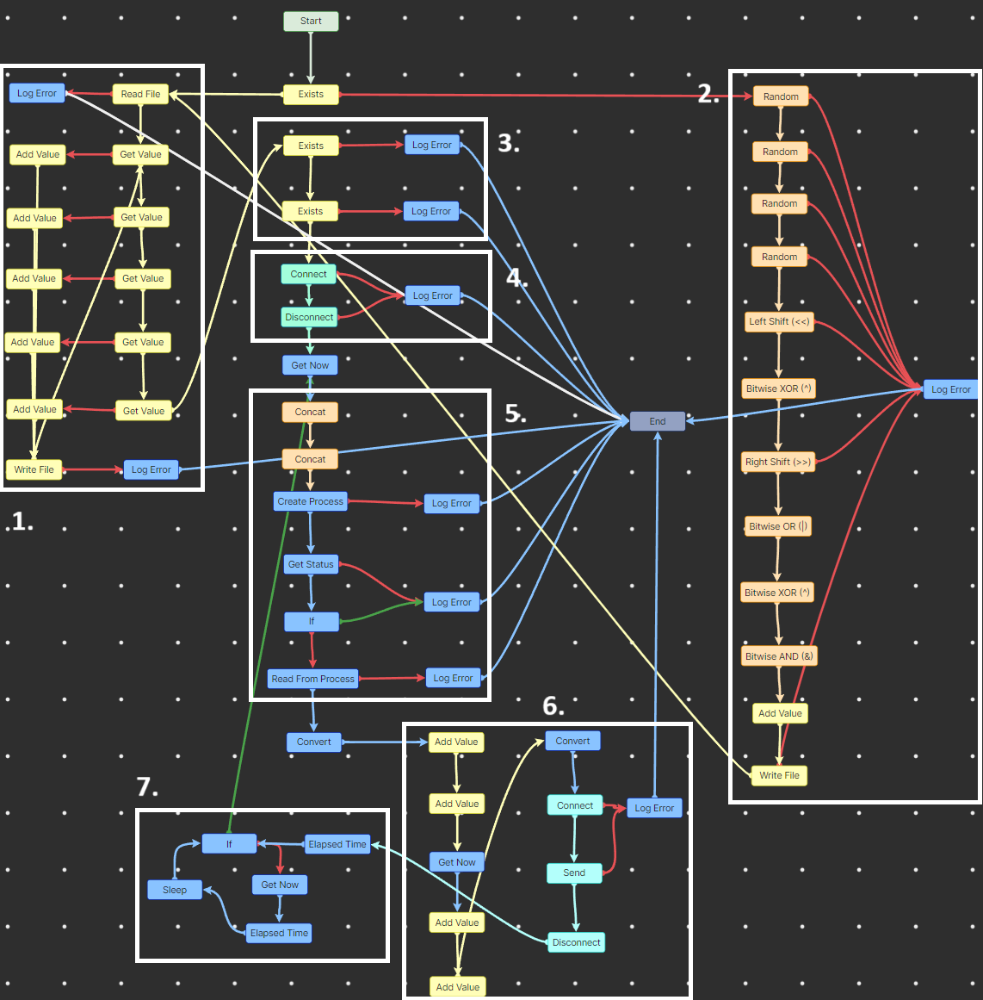

# Projeto de Desenvolvimento Integrado de Software - Câmara NIOP
## Grupo 3 - 2024/25

## Introdução

O projeto consiste na implementação de um sistema de deteção de pessoas em imagens, utilizando técnicas de visão computacional e machine learning para contar o número de pessoas presentes numa determinada paragem de autocarro. A partir ou de imagens ou de uma stream de webcam, o sistema deve ser capaz de identificar e contar o número de pessoas presentes na imagem ou stream.

A utilização deste sistema será feita por parte de um operador de transportes públicos, que poderá utilizar a informação obtida para otimizar a gestão de recursos e melhorar a eficiência do serviço prestado.

Esta parte do projeto feito na plataforma de low-code NIOP tem o objetivo de criar uma aplicação de captura e processamento de imagens capturadas por uma câmera instalada numa paragem de autocarro para contabilização de passageiros. Este projeto integra-se par a par com o projeto camara-py que é responsável por processar uma imagem ou stream de vídeo e contar o número de passageiros que existam na imagem. 

O projeto aqui feito em NIOP serve principalmente para receber essas informações e enviar para um servidor utilizando WebSocket.

## Instalação

Devido ao facto de o projeto ter sido desenvolvido utilizando a plataforma NIOP, é somente necessário fazer o download do projeto e abrir o mesmo na plataforma NIOP. Para tal, é necessário ter o NIOP studio instalado no seu sistema e ter um conhecimento básico de como utilizar a plataforma NIOP.

Como a plataforma NIOP funciona de forma cliente-servidor para executar o projeto, é necessário ter o servidor NIOP a correr para poder executar o projeto. Para tal, é necessário iniciar o servidor NIOP (niop Engine) e depois abrir o projeto na plataforma NIOP. Assim, ao executar o seguinte comando no terminal, o servidor NIOP irá iniciar:
```bash
& "C:\Program Files\Neadvance\niop Engine\niopEngine.exe" 0.0.0.0 8091 2
```
Após o servidor NIOP estar a correr, é possível abrir o projeto na plataforma NIOP, clicar em publicar, depois clicar em publicar workflow e de seguida clicar em publicar. Após isso, o projeto irá correr e estará disponível para ser utilizado.

## Execução

Como o projeto foi concebido para ser "standalone", somente é necessário configurar algumas variáveis num ficheiro de configuração. Para tal, é necessário abrir o ficheiro `info.json` e configurar as variáveis de acordo com o seu sistema. As variáveis que devem ser configuradas são as seguintes:
```json
{
    "comando": "main.exe",
    "identificador": 1882545984,
    "modelo": "yolov5su.pt",
    "server_ip": "localhost:8765",
    "tempo_captura": 10
}
```
- `comando`: O comando que irá ser executado para capturar a imagem. O valor padrão é `main.exe`, que é o executável do projeto camara-py. Se o executável estiver em outro local, deve especificar o caminho completo para o executável.
- `identificador`: O identificador da câmera. O valor padrão é um número gerado aleatoriamente. Este número é utilizado para identificar a câmera na aplicação. Se o número não for único, o projeto terá problemas na backend que processa as contabilizações de passageiros.
- `modelo`: O modelo que irá ser utilizado para a deteção de pessoas. O valor padrão é `yolov5su.pt`, que é o modelo pré-treinado. Se quiser utilizar outro modelo, deve especificar o caminho para o arquivo de pesos correspondente. Para além de especificar o modelo, deve também ter o modelo na mesma pasta que o executável do projeto camara-py. Para tal, é necessário fazer o download do modelo YOLOv5 em [https://github.com/ultralytics/yolov5/releases](https://github.com/ultralytics/yolov5/releases).
- `server_ip`: O endereço IP do servidor que irá receber as informações. O valor padrão é `localhost:8765`, que é o endereço IP da backend que recebe as informações. Se o servidor estiver em outro local, deve especificar o endereço IP correto.
- `tempo_captura`: O período de tempo em segundos que a câmera irá capturar a imagem. Este número significa quanto em quanto tempo a câmera irá capturar uma nova imagem. O valor padrão é 10 segundos, mas pode ser alterado para o valor que quiser. O valor mínimo é 1 segundo.

## Explicação do projeto

Devido ao facto que o projeto é "low-code/no-code", não é possível explicar o projeto a partir de linhas de código. Assim, o projeto é dividido em várias partes que são explicadas de seguida:


### Legenda
#### 1. Obtenção de configurações

Neste passo, o projeto irá obter as configurações do ficheiro `info.json` e irá guardar as variáveis em variáveis que serão utilizadas no projeto. 

Se o ficheiro `info.json` não existir ou não estiver configurado corretamente, o projeto irá falhar e não irá funcionar. Assim, é necessário ter o ficheiro `info.json` configurado corretamente para que o projeto funcione. 

Como forma de prevenir erros, a aplicação irá automaticamente introduzir alguns valores padrão caso o ficheiro `info.json` esteja vazio.

#### 2. Geração de identificador da câmera único

Esta secção do projeto realiza algumas operações bitwise para gerar um identificador único para a câmera. O identificador é gerado a partir de 4 números aleatórios, que em seguida sofrem operações bitwise para gerar um número único. Este número é utilizado para identificar a câmera na base de dados como sendo única.

#### 3. Verificação de se o modelo e o executável existem

Este passo do projeto verifica se o modelo e o executável existem. Se não existirem, o projeto irá falhar e não irá funcionar. Assim, é necessário ter o modelo e o executável na mesma pasta que o projeto para que o projeto funcione.

#### 4. Verificação de se existe uma câmera disponível

Esta secção do projeto verifica se existe uma câmera disponível ao conectar-se a uma qualquer primeira câmera disponível. Se não existir nenhuma câmera disponível, o projeto irá falhar e não irá funcionar.

#### 5. Execução do comando para capturar e processar a imagem (camara-py)

Dependendo do comando que foi configurado no ficheiro `info.json`, o projeto irá executar o comando para capturar a imagem. Para além desse comando configurado, o projeto irá também concatenar o modelo configurado no mesmo ficheiro ficando algo como `main.exe -m yolov5su.pt`. Assim, o projeto irá executar o comando para capturar a imagem e processar a imagem utilizando o modelo configurado. 

#### 6. Envio de informações para o servidor

Nesta secção do projeto, o projeto irá enviar as informações para uma backend configurada previamente no ficheiro `info.json`. O projeto irá enviar as informações utilizando WebSocket, e da seguinte forma:
```json
{
    "camera_id": 1882545984,
    "destination": "camera_data",
    "people_count": 9,
    "timestamp": "1744818115"
}
```
- `camera_id`: O identificador da câmera. Este número deverá já ter sido gerado anteriormente e deverá ser o mesmo que foi gerado na secção 2 ou que foi configurado manualmente no ficheiro `info.json`.
- `destination`: O destino da mensagem. Este número é o nome do endpoint que irá receber a mensagem. O valor padrão é `camera_data`, que é o endpoint que irá receber as informações. 
- `people_count`: O número de pessoas detetadas na imagem. Este número é o número de pessoas que foram detetadas na imagem capturada.
- `timestamp`: O timestamp da imagem. Feito utilizando o epoch Unix, este número é o timestamp de quando o sistema capturou a imagem ou que executou o camera-py.

#### 7. Loop para capturar a imagem de tempos em tempos

Nesta última secção do projeto, a aplicação irá ficar à espera durante o tempo configurado no ficheiro `info.json` e irá capturar a imagem periodicamente. O projeto irá continuar a correr até que o utilizador o pare manualmente ou que o servidor NIOP seja parado. 

**NOTA:** Como só temos acesso à versão trial do NIOP, a aplicação só irá executar durante 180 minutos. Após esse tempo, a aplicação irá parar automaticamente e não irá funcionar. Caso isso aconteça, é necessário dar o redeploy do workflow para que a aplicação volte a funcionar.

## Licença

MIT License. Veja o ficheiro [LICENSE](LICENSE) para mais detalhes.