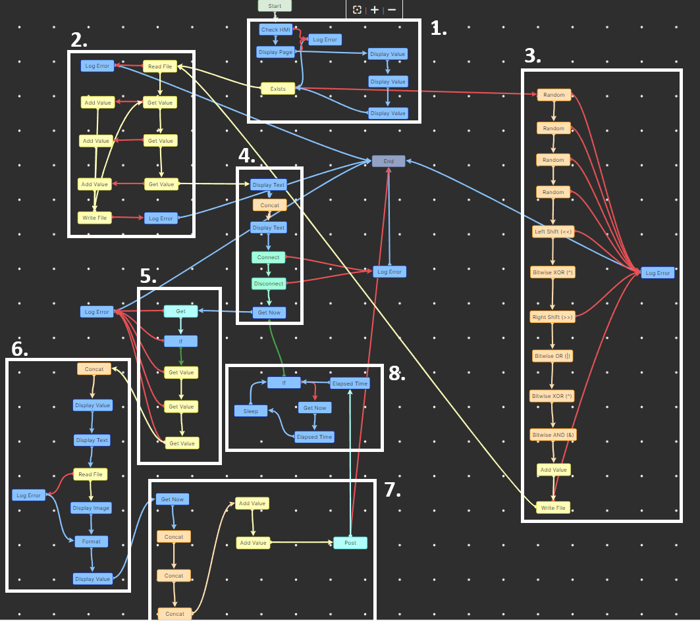

# Projeto de Desenvolvimento Integrado de Software - Câmara NIOP
## Grupo 3 - 2024/25

## Introdução

O projeto consiste na implementação de um sistema de deteção de pessoas em imagens, utilizando técnicas de visão computacional e machine learning para contar o número de pessoas presentes numa determinada paragem de autocarro. A partir ou de imagens ou de uma stream de webcam, o sistema deve ser capaz de identificar e contar o número de pessoas presentes na imagem ou stream.

A utilização deste sistema será feita por parte de um operador de transportes públicos, que poderá utilizar a informação obtida para otimizar a gestão de recursos e melhorar a eficiência do serviço prestado.

Esta parte do projeto feito na plataforma de low-code NIOP tem o objetivo de criar uma aplicação de captura e processamento de imagens capturadas por uma câmera instalada numa paragem de autocarro para contabilização de passageiros. Este projeto integra-se par a par com o projeto camara-py que é responsável por processar uma imagem ou stream de vídeo e contar o número de passageiros que existam na imagem. 

O projeto aqui feito em NIOP serve principalmente para receber essas informações e enviar para um servidor utilizando WebSocket.

## Instalação

Devido ao facto de o projeto ter sido desenvolvido utilizando a plataforma NIOP, é somente necessário fazer o download do projeto e abrir o mesmo na plataforma NIOP. Para tal, é necessário ter o NIOP studio instalado no seu sistema e ter um conhecimento básico de como utilizar a plataforma NIOP. Tanto como o NIOP studio, é necessário ter o NIOP HMI instalado no seu sistema. O NIOP HMI é a plataforma que permite executar as GUI criadas na plataforma NIOP.

Como a plataforma NIOP funciona de forma cliente-servidor para executar o projeto, é necessário ter o servidor NIOP a correr para poder executar o projeto. Para tal, é necessário iniciar o servidor NIOP (niop Engine) e depois abrir o projeto na plataforma NIOP. Assim, ao executar o seguinte comando no terminal, o servidor NIOP irá iniciar:
```bash
& "C:\Program Files\Neadvance\niop Engine\niopEngine.exe" 0.0.0.0 8091 2
```
Após o servidor NIOP estar a correr, é possível abrir o projeto na plataforma NIOP, clicar em publicar, depois clicar em publicar workflow e de seguida clicar em publicar. Após isso, o projeto irá correr e estará disponível para ser utilizado.

## Execução

Como o projeto foi concebido para ser "standalone", somente é necessário configurar algumas variáveis num ficheiro de configuração. Para tal, é necessário abrir o ficheiro `info.json` e configurar as variáveis de acordo com o seu sistema. As variáveis que devem ser configuradas são as seguintes:
```json
{
    "identificador": 5,
    "server_ip": "https://backend.dnigamer.xyz",
    "tempo_captura": 10
}
```
As variáveis que devem ser configuradas são as seguintes:
- `identificador`: O identificador da câmera. O valor padrão é um número gerado aleatoriamente. Este número é utilizado para identificar a câmera na aplicação. Se o número não for único em relação a uma outra câmara no sistema, o projeto terá problemas na backend que processa as contabilizações de passageiros.
- `server_ip`: O endereço IP do servidor que irá receber as informações. Este endereço IP deve ser o endereço do servidor de backend que irá receber as informações enviadas pela aplicação, como dados de lotação de paragens, entre outros. O valor padrão é `https://backend.dnigamer.xyz`, e deve ser alterado para o endereço do seu servidor. 
- `tempo_captura`: O período de tempo em segundos que a câmera irá capturar a imagem. Este número significa quanto em quanto tempo a câmera irá capturar uma nova imagem. O valor padrão é 10 segundos, mas pode ser alterado para o valor que quiser. O valor mínimo é 1 segundo.

**NOTA:** O endereço IP (`server_ip`) deve ser o endereço do servidor que está a correr o backend `server-py`, um servidor RESTful que recebe as informações enviadas pela aplicação.

### GUI integrado do camara-niop
Como nova versão do projeto, foi adicionado uma GUI integrada no projeto camara-niop. Esta GUI permite ao utilizador ver o estado da captura, a imagem capturada e o número de pessoas detetadas na imagem. A GUI é atualizada em tempo real e permite ao utilizador ver o estado da captura e o número de pessoas detetadas na imagem.


#### Como analizar a GUI
A GUI é dividida em várias secções, a da imagem capturada, a das informações da captura e estado da captura. 

A secção da imagem capturada mostra a imagem capturada pela câmera, a secção das informações da captura mostra o número de pessoas detetadas na imagem, tal como o ID da câmera e a data e hora da última captura. 

A secção do estado da captura mostra o tempo que demorou a capturar a imagem e o intervalo de tempo entre capturas.

## Explicação do projeto

Devido ao facto que o projeto é "low-code/no-code", não é possível explicar o projeto a partir de linhas de código.

Assim, o projeto é dividido em várias partes que são explicadas de seguida:


### Legenda
#### 1. Verificações iniciais

Nesta secção do programa, o algoritmo irá verificar se existe tanto o ficheiro `info.json` como o HMI para poder mostrar a GUI do programa. Se não existir o ficheiro `info.json`, o algoritmo irá automaticamente criar o ficheiro com os valores padrão. 

Se não existir o HMI, o algoritmo irá continuar a execução do programa sem mostrar a GUI, mas irá continuar a funcionar em background.

#### 2. Criação de variáveis e do ficheiro info.json

Neste passo, o projeto irá obter as configurações do ficheiro `info.json` e irá guardar as variáveis em variáveis que serão utilizadas no projeto. 

Se o ficheiro `info.json` não existir ou não estiver configurado corretamente, o projeto irá falhar e não irá funcionar. Assim, é necessário ter o ficheiro `info.json` configurado corretamente para que o projeto funcione. 

Como forma de prevenir erros, a aplicação irá automaticamente introduzir alguns valores padrão caso o ficheiro `info.json` esteja vazio.

#### 3. Geração de identificador da câmera único

Esta secção do projeto realiza algumas operações bitwise para gerar um identificador único para a câmera. O identificador é gerado a partir de 4 números aleatórios, que em seguida sofrem operações bitwise para gerar um número único.

Este número é utilizado para identificar a câmera na base de dados como sendo única.

#### 4. Verificação de se existe uma câmera disponível

Esta secção do projeto verifica se existe uma câmera disponível ao conectar-se a uma qualquer primeira câmera disponível.

Esta parte do projeto serve primariamente para garantir que o resto do projeto funciona corretamente, uma vez que o projeto camara-py irá utilizar a câmera para capturar a imagem e processar a mesma.

Se não existir nenhuma câmera disponível, o projeto irá falhar e não irá funcionar. Assim, é necessário ter uma câmera (webcam por USB por exemplo) disponível para que o projeto funcione corretamente.

#### 5. Chamada GET ao camera-py

Nesta secção do projeto, o algoritmo irá fazer uma chamada GET ao projeto camara-py para capturar a imagem. O projeto camara-py é responsável por capturar a imagem e processar a mesma utilizando um modelo de machine learning para contar o número de pessoas na imagem.

Aqui também é feita alguma verificação de erros, como por exemplo, se a chamada GET falhar. Se a chamada GET falhar, o projeto irá falhar e não irá funcionar. Assim, é necessário garantir que o projeto camara-py está a correr e que a chamada GET funciona corretamente.

#### 6. Processamento dos dados recebidos

Nesta secção do projeto, o projeto irá enviar as informações para uma backend configurada previamente no ficheiro `info.json`. O projeto irá enviar as informações utilizando o endpoint `/api/camaras/{camera_id}/lotacao` e uma chamada POST. 

O corpo da mensagem deverá ser um JSON com a seguinte estrutura:
```json
{
    "people_count": 9,
    "timestamp": "1744818115"
}
```

Os campos que devem ser preenchidos são os seguintes:
- `people_count`: O número de pessoas detetadas na imagem. Este número é o número de pessoas que foram detetadas na imagem capturada.
- `timestamp`: O timestamp da imagem. Feito utilizando o epoch Unix, este número é o timestamp de quando o sistema capturou a imagem ou que executou o camera-py.

#### 7. Envio dos dados para o servidor
Nesta secção do projeto, o algoritmo irá enviar os dados para o servidor utilizando uma chamada POST. O projeto irá enviar as informações utilizando o endpoint `/api/camaras/{camera_id}/lotacao` e uma chamada POST.

#### 8. Loop para capturar a imagem de tempos em tempos

Nesta última secção do projeto, a aplicação irá ficar à espera durante o tempo configurado no ficheiro `info.json` e irá capturar a imagem periodicamente. O projeto irá continuar a correr até que o utilizador o pare manualmente ou que o servidor NIOP seja parado.

## Avisos finais

**NOTA:** Como só temos acesso à versão trial do NIOP, a aplicação só irá executar durante 180 minutos. Após esse tempo, a aplicação irá parar automaticamente e não irá funcionar. Caso isso aconteça, é necessário dar o redeploy do workflow para que a aplicação volte a funcionar.

## Licença

MIT License. Veja o ficheiro [LICENSE](LICENSE) para mais detalhes.