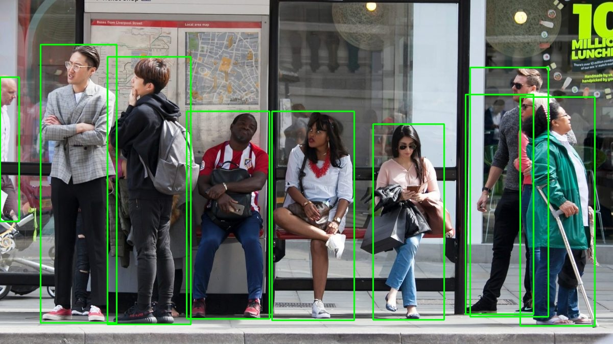

# Projeto de Desenvolvimento Integrado de Software - Câmara Python
## Grupo 3 - 2024/25

## Introdução

O projeto consiste na implementação de um sistema de deteção de pessoas em imagens, utilizando técnicas de visão computacional e machine learning para contar o número de pessoas presentes numa determinada paragem de autocarro. A partir ou de imagens ou de uma stream de webcam, o sistema deve ser capaz de identificar e contar o número de pessoas presentes na imagem ou stream.

A utilização deste sistema será feita por parte de um operador de transportes públicos, que poderá utilizar a informação obtida para otimizar a gestão de recursos e melhorar a eficiência do serviço prestado.

Este projeto feito em Python, utiliza certas bibliotecas e modelos de machine learning para realizar a deteção de pessoas que não estão disponíveis no programa indicado para o desenvolvimento deste projeto (niop Studio). Assim, parte do projeto foi desenvolvido fora do niop Studio, utilizando Python e as bibliotecas OpenCV, Ultralytics e NumPy para integração com um algoritmo de deteção de objetos. 

O modelo YOLOv5 foi utilizado para a deteção de pessoas, e o algoritmo de contagem foi implementado utilizando técnicas de processamento de imagem e machine learning.

## Instalação

Devido ao facto de o projeto ter sido desenvolvido fora do niop Studio, é necessário instalar as bibliotecas necessárias para a execução do projeto. Para tal, é necessário ter o Python 3.8 ou superior instalado no seu sistema para poder fazer ou a compilação do projeto ou a execução do mesmo. 

Para instalar as bibliotecas necessárias, execute o seguinte comando no terminal:
```bash
pip install -r requirements.txt
```

## Execução

Após a instalação das bibliotecas necessárias, é possível executar o projeto. Para tal, execute o seguinte comando no terminal:
```bash
python main.py
```

Sem qualquer argumento passado, o programa vai automaticamente tirar uma imagem da webcam e executar a deteção de pessoas nessa imagem capturada utilizando um modelo predefinido do YOLOv5. Se não houver webcam disponível, o programa irá falhar por não ter nenhuma imagem para processar.

### Argumentos

#### --image, -i

O argumento `--image` ou `-i` permite especificar o caminho para uma imagem de entrada. Se não for fornecido, o programa irá utilizar a webcam como fonte de imagem.

#### --verbose, -v

O argumento `--verbose` ou `-v` ativa a saída detalhada do programa. Isso pode incluir informações adicionais sobre o processamento da imagem e os resultados da deteção.

#### --output, -o

O argumento `--output` ou `-o` permite especificar o caminho para salvar a imagem de saída. Se não for fornecido, a imagem de saída não será salva.

#### --model, -m

O argumento `--model` ou `-m` permite especificar o caminho para o arquivo de pesos do modelo YOLOv5. O valor padrão é `yolov5su.pt`, que é um modelo pré-treinado. Se quiser utilizar outro modelo, deve especificar o caminho para o arquivo de pesos correspondente.

#### --server, -s

O argumento `--server` ou `-s` ativa o modo de execução como um servidor FastAPI. Isso permite que o programa seja executado como uma API REST, onde pode ser chamado para processar imagens e retornar os resultados em formato JSON.

#### --camera, -c

O argumento `--camera` ou `-c` permite especificar o ID da câmara a utilizar como fonte de imagem. O ID da câmara é o número da câmara que pode ser utilizado para selecionar a câmara a utilizar como imagem de entrada. Se não for fornecido, o programa irá utilizar a câmara padrão do sistema de ID 0.

#### --help

O argumento `--help` exibe a ajuda do programa, mostrando todos os argumentos disponíveis e suas descrições.

**NOTA:** Reforçando, se não for fornecido nenhum argumento, o programa irá utilizar o modelo pré-treinado `yolov5su.pt` como padrão e imprimirá apenas os resultados na consola sem qualquer outra informação ou output.

## Exemplo de execução

Como exemplo, vamos executar o programa utilizando a câmara como imagem de entrada e ativando a saída detalhada:
```bash
python main.py --verbose --output /caminho/para/imagem_saida.jpg
```
Isto irá processar a imagem especificada, ativar a saída detalhada e guardar a imagem de saída no caminho especificado. O programa irá imprimir os resultados da deteção na consola.
```txt
Captured image from camera and saved as 'frame.jpg'.
Using model: yolov5lu.pt
Input image: frame.jpg
Output image: imagem_saida.jpg
Model loaded from yolov5lu.pt.
Number of people detected: 9
Saving output image to 'imagem_saida.jpg'.
```

Como imagem de entrada, foi esta a imagem capturada:


E como imagem de saída, foi esta a imagem processada:


Como é possível observar, o programa conseguiu detetar 9 pessoas na imagem capturada. Nem sempre o número de pessoas detetadas corresponde ao número real de pessoas na imagem, uma vez que o modelo YOLOv5 pode ter dificuldades em detetar pessoas em determinadas condições de iluminação ou ângulos de visão. No entanto, o modelo é bastante preciso e consegue detetar a maioria das pessoas presentes na imagem.

## Exemplo de execução em modo REST API

Para executar o projeto em modo REST API, é necessário ter o fastapi instalado. Para tal, execute o seguinte comando no terminal:
```bash
pip install fastapi
```

Após a instalação do fastapi, só é necessário executar o seguinte comando no terminal para iniciar o servidor:
```bash
python main.py --server
```

Isto irá iniciar o servidor FastAPI na porta 8000. O servidor irá expor um endpoint `/detect` que pode ser utilizado para analizar a imagem da webcam sempre que for chamado. O endpoint irá retornar um JSON com o número de pessoas detetadas na imagem capturada, dentro do seguinte formato:
```json
{
    "num_pessoas":0,
    "tempo":327.0,
    "output_path":"...\\camara-py\\output.jpg"
}
```
O campo `num_pessoas` indica o número de pessoas detetadas na imagem, o campo `tempo` indica o tempo que demorou a processar a imagem e o campo `output_path` indica o caminho para a imagem de saída.

## Endpoints REST API
O servidor FastAPI irá expor os seguintes endpoints:

### GET `/detect`
Este endpoint irá capturar uma imagem da webcam, processá-la e retornar o número de pessoas detetadas na imagem. O tempo que demorou a processar a imagem e o caminho para a imagem de saída também serão retornados.

### GET `/camaras`
Este endpoint irá retornar uma lista com os IDs das câmaras disponíveis no sistema. O ID da câmara é o número da câmara que pode ser utilizado para selecionar a câmara a utilizar como imagem de entrada.

## Compilação para um ficheiro executável

Para compilar o projeto para um ficheiro executável, é necessário ter o PyInstaller instalado. Para tal, execute o seguinte comando no terminal:
```bash
pip install pyinstaller
```

Após a instalação do PyInstaller, execute o seguinte comando no terminal para compilar o projeto:
```bash
pyinstaller --onefile main.py
```

Isto irá gerar um ficheiro executável na pasta `dist` com o nome `main.exe` (ou `main` no Linux). O ficheiro executável pode ser executado diretamente sem a necessidade de ter o Python ou as bibliotecas instaladas.

O executável irá funcionar da mesma forma que o script Python, aceitando os mesmos argumentos e opções. No entanto, é importante notar que o executável pode ser maior em tamanho devido à inclusão das bibliotecas necessárias.

Outro ponto a ter em conta é que o executável não irá funcionar fora do sistema operativo para o qual foi compilado. Ou seja, se compilar o projeto no Windows, o executável só irá funcionar no Windows. Para compilar o projeto para outro sistema operativo, deve-se utilizar o PyInstaller nesse sistema operativo.

### Considerações acerca do executável

O programa de saída pode demorar algum tempo a ser gerado, cerca de 2 a 3 minutos, dependendo do tamanho do projeto e da velocidade do computador usado. 

O tempo de execução do programa de saída é **relativamente mais elevado** comparando com a execução direta do código utilizando o comando `python main.py`, devido à inclusão de todas as bibliotecas necessárias para a execução do projeto. O tempo de execução do programa de saída pode variar consoante o sistema operativo e o computador utilizado.

É altamente recomendável executar o projeto antes de o compilar para um executável, para garantir que tudo está a funcionar corretamente. Caso contrário, o executável pode não funcionar como esperado.

## Licença

MIT License. Veja o ficheiro [LICENSE](LICENSE) para mais detalhes.