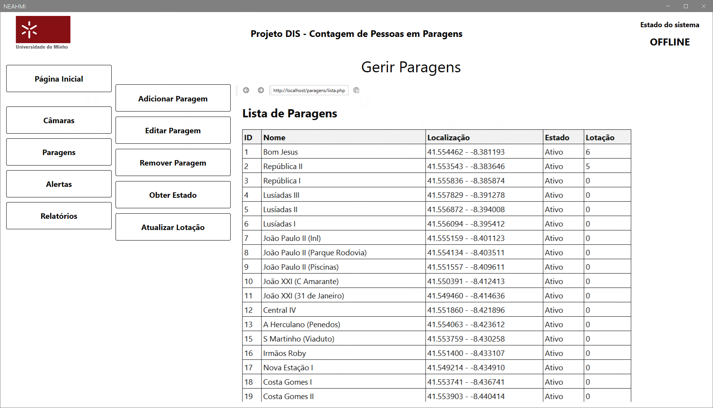
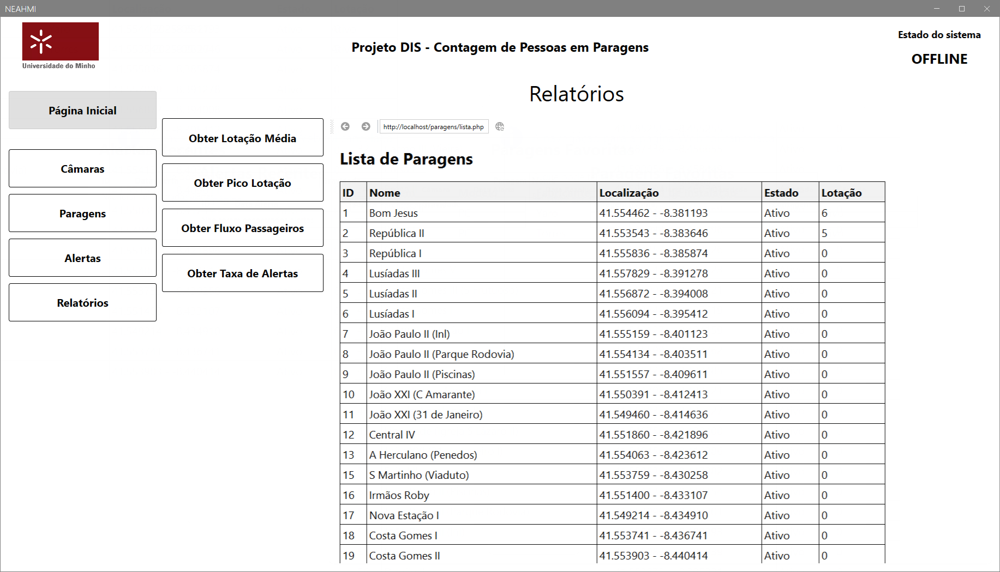

# sistema-niop

## Introdução
Esta pasta contém o código total do sistema que apresenta os dados registados na base de dados do sistema de contagem de pessoas nas paragens. Esta aplicação foi desenvolvida utilizando a ferramenta de low-code niop. 

O sistema consiste numa aplicação contendo diferentes páginas, cada uma com um propósito específico. Abaixo, apresentamos uma breve descrição de cada página e suas funcionalidades.

## Execução do projeto
Para executar o projeto, é necessário ter o niop instalado, tal como uma base de dados MySQL e um servidor web (Apache, Nginx, etc.) configurado para servir os ficheiros PHP do projeto.

1. **Instalar o niop**: Siga as instruções de instalação do niop studio e do niop HMI.
2. **Configurar a base de dados**: Certifique-se de que a base de dados MySQL está configurada corretamente e que as tabelas necessárias estão criadas. Para informações sobre a estrutura da base de dados, consulte o script de criação da base de dados incluído no projeto.
3. **Configurar o servidor web**: Configure o servidor web para apontar para a pasta onde os ficheiros do projeto estão localizados (ex. `http://localhost/`).
4. **Executar o projeto**: Após verificar que tudo está configurado corretamente, abra o niop HMI, niop Studio e inicie o projeto. A aplicação deve carregar e apresentar as páginas que compõem o sistema.

## Requisitos
- **niop**: Ferramenta de desenvolvimento low-code/no-code.
- **PHP**: Versão 7.4 ou superior.
- **MySQL**: Versão 5.7 ou superior.
- **Servidor Web**: Apache, Nginx ou outro servidor compatível com PHP.

## Instalação

Para instalar a parte do sistema que carrega as páginas PHP, siga os seguintes passos:
1. **Instale o XAMPP**: O XAMPP é um pacote que inclui o Apache, MySQL e PHP. Pode ser descarregado a partir do site oficial do XAMPP (https://www.apachefriends.org/index.html).
2. **Descarregue o projeto**: Faça o download do código do projeto a partir do repositório GitHub ou do local onde o código está hospedado.
3. **Coloque os ficheiros na pasta do XAMPP**: Copie os conteúdos da pasta html-pages do projeto diretamente para a pasta `htdocs` do XAMPP. Normalmente, esta pasta está localizada em `C:\xampp\htdocs` no Windows ou `/opt/lampp/htdocs` no Linux.
   - Exemplo: Se o nome do projeto for `sistema-niop`, a estrutura de pastas deve ser `C:\xampp\htdocs\` ou `/opt/lampp/htdocs/` tendo todos os subdiretórios e ficheiros do projeto dentro dessa pasta.
      ```
      C:\xampp\htdocs\
        ├── alertas
            ├── adicionar.php
            ├── desativar.php
            ├── editar.php
            ├── enviar.php
            ├── lista.php
            ├── recentes.php
            └── remover.php
        ├── camaras
            ├── adicionar.php
            ├── contagem.php
            ├── editar.php
            ├── lista.php
            └── remover.php
        ├── paragens
            ├── adicionar.php
            ├── editar.php
            ├── estado.php
            ├── favoritas.php
            ├── lista.php
            ├── lotacao.php
            └── remover.php
        ├── relatorios
            ├── fluxo_passageiros.php
            ├── geral.php
            ├── lotacao_media.php
            ├── pico_lotacao.php
            └── taxa_alertas.php
        ├── static
            └── css
                ├── style-small.css
                └── style.css
        └── config.php
      ```
4. **Configurar o XAMPP**: Certifique-se de que o XAMPP está configurado corretamente para servir ficheiros PHP. Normalmente, isso já está configurado por padrão.
   - Para além disso, verifique o ficheiro `config.php` na raiz do projeto para garantir que as configurações de conexão com a base de dados estão corretas (nome do utilizador, palavra-passe, nome da base de dados).
      ```php
      <?php
      $host = 'ip-do-servidor';    // Exemplo: 'localhost' ou '127.0.0.1'
      $dbname = 'bd_sistema_niop'; // Nome da base de dados
      $username = 'user';          // Nome de utilizador da base de dados
      $password = 'palavra-passe'; // Palavra-passe da base de dados
      ...
      ```

4. **Inicie o XAMPP**: Abra o painel de controlo do XAMPP e inicie os serviços do Apache e MySQL.
5. **Aceda ao servidor XAMPP**: Abra um navegador web e digite `http://localhost`, onde `nome-do-projeto` é o nome da pasta que você copiou para a pasta `htdocs` (de preferência, `http://localhost/` pois o projeto é carregado diretamente na raiz do servidor). 

Ao aceder a esta URL, deverá ver o conteúdo da pasta `htdocs`, incluindo os ficheiros do projeto.

## Explicação do projeto

Devido ao facto que o projeto é "low-code/no-code", não é possível explicar o projeto a partir de linhas de código. 

Este projeto pode conter bastantes linhas a ir de um lado para o outro, mas a explicação do projeto é bastante simples, pois o projeto somente apresenta interfaces gráficas e não contém lógica de operações complexas.

O sistema é composto por uma interface gráfica (HMI) que permite ao utilizador interagir com as diferentes funcionalidades do sistema. A lógica de funcionamento do sistema é dividida em duas partes principais: a parte direita e a parte esquerda. 

Assim, o código do projeto é composto por pelo menos 2 partes principais:


**Parte esquerda**: Contém a lógica que verifica se o HMI está ONLINE ou OFFLINE, e funcional, verificando se houve algum input do utilizador, alterando a página atual.

**Parte direita**: Contém a lógica de mudança de paginas, onde cada página é uma entidade que contém os componentes e a lógica para realizaar operações específicas (ex. Câmaras, Paragens, Alertas, Relatórios).

## Página Inicial

A página inicial do sistema serve como um painel de controle central, oferecendo uma visão geral rápida do estado do sistema e acesso às principais funcionalidades. Ela contém:

- **Menu Lateral**: Localizado à esquerda, permite navegar entre as diferentes páginas do sistema, como:
  - **Câmaras**: Gerenciamento das câmaras conectadas.
  - **Paragens**: Informações sobre as paragens monitoradas.
  - **Alertas**: Exibição de alertas recentes.
  - **Relatórios**: Geração e visualização de relatórios.
  - **Configurações**: Ajustes e preferências do sistema.

- **Estado do Sistema**: Exibido no canto superior direito, indicando se o sistema está operacional (ONLINE) ou não (OFFLINE).

- **Alertas Recentes**: Uma tabela central que lista os alertas mais recentes, incluindo informações como ID, data, descrição do alerta e gravidade.

- **Paragens Favoritas**: Uma tabela que exibe as paragens marcadas como favoritas pelo usuário, com informações como nome e contagem de pessoas.

- **Mensagem de Boas-Vindas**: Um texto centralizado que dá as boas-vindas ao usuário.

Essa página foi projetada para ser intuitiva e fornecer acesso rápido às informações mais importantes do sistema.

Imagem:


## Câmaras

A página de **Câmaras** permite gerenciar as câmaras conectadas ao sistema. Nela, o usuário pode realizar as seguintes ações:

- **Adicionar Câmara**: Inserir uma nova câmara no sistema, especificando informações como modelo, fabricante, e paragem associada.
- **Editar Câmara**: Atualizar os dados de uma câmara existente.
- **Remover Câmara**: Excluir uma câmara do sistema.
- **Obter Contagem**: Consultar a contagem de pessoas registrada por uma câmara específica.

Além disso, a página exibe uma tabela com a lista de câmaras registadas, contendo as seguintes informações:
- **ID**: Identificador único da câmara.
- **Paragem**: Paragem associada à câmara.
- **Modelo**: Modelo da câmara.
- **Fabricante**: Fabricante da câmara.
- **Data de Instalação**: Data em que a câmara foi instalada.
- **Estado**: Estado atual da câmara (Ativo ou Inativo).

Essa página foi projetada para facilitar o gerenciamento das câmaras e garantir que todas as informações estejam organizadas e acessíveis.

Imagem:


## Paragens

A página de **Paragens** permite gerenciar as paragens monitoradas pelo sistema. Nela, o usuário pode realizar as seguintes ações:

- **Adicionar Paragem**: Inserir uma nova paragem no sistema, especificando informações como nome e localização.
- **Editar Paragem**: Atualizar os dados de uma paragem existente.
- **Remover Paragem**: Excluir uma paragem do sistema.
- **Obter Estado**: Consultar o estado atual de uma paragem (Ativo ou Inativo).
- **Atualizar Lotação**: Atualizar manualmente a lotação de uma paragem.

Além disso, a página exibe uma tabela com a lista de paragens cadastradas, contendo as seguintes informações:
- **ID**: Identificador único da paragem.
- **Nome**: Nome da paragem.
- **Localização**: Localização da paragem.
- **Estado**: Estado atual da paragem (Ativo ou Inativo).
- **Lotação**: Número atual de pessoas na paragem.

Essa página foi projetada para facilitar o gerenciamento das paragens e garantir que todas as informações estejam organizadas e acessíveis.

Imagem:


## Alertas

A página de **Alertas** permite gerenciar os alertas gerados pelo sistema. Nela, o usuário pode realizar as seguintes ações:

- **Adicionar Alerta**: Criar um novo alerta no sistema, especificando informações como paragem, câmara, tipo e descrição.
- **Editar Alerta**: Atualizar os dados de um alerta existente.
- **Remover Alerta**: Excluir um alerta do sistema.
- **Enviar Alerta**: Notificar os responsáveis sobre um alerta específico.
- **Desativar Alerta**: Alterar o estado de um alerta para desativado.

Além disso, a página exibe uma tabela com a lista de alertas registrados, contendo as seguintes informações:
- **ID**: Identificador único do alerta.
- **Paragem**: Paragem associada ao alerta.
- **Câmara**: Câmara associada ao alerta.
- **Data Alerta**: Data em que o alerta foi gerado.
- **Data Resolução**: Data em que o alerta foi resolvido (se aplicável).
- **Tipo Alerta**: Tipo do alerta (e.g., Serviço, Segurança).
- **Descrição**: Descrição detalhada do alerta.
- **Gravidade**: Nível de gravidade do alerta.
- **Estado**: Estado atual do alerta (e.g., Pendente, Finalizado).

Essa página foi projetada para facilitar o acompanhamento e a resolução de problemas detectados pelo sistema, garantindo que os alertas sejam tratados de forma eficiente.

Imagem:


## Relatórios

A página de **Relatórios** permite gerar e visualizar relatórios baseados nos dados coletados pelo sistema. Nela, o usuário pode realizar as seguintes ações:

- **Obter Lotação Média**: Calcular a lotação média das paragens monitoradas.
- **Obter Pico Lotação**: Identificar o pico de lotação em cada paragem.
- **Obter Fluxo Passageiros**: Analisar o fluxo de passageiros em diferentes paragens.
- **Obter Taxa de Alertas**: Calcular a taxa de alertas gerados em relação ao total de paragens ou câmaras.

Além disso, a página exibe uma tabela com a lista de paragens, contendo as seguintes informações:
- **ID**: Identificador único da paragem.
- **Nome**: Nome da paragem.
- **Localização**: Localização da paragem.
- **Estado**: Estado atual da paragem (Ativo ou Inativo).
- **Lotação**: Número atual de pessoas na paragem.

Essa página foi projetada para fornecer relatórios detalhados sobre o sistema, ajudando na tomada de decisões e no acompanhamento do desempenho das paragens monitoradas.

Imagem:


## Licença

MIT License. Veja o ficheiro [LICENSE](LICENSE) para mais detalhes.